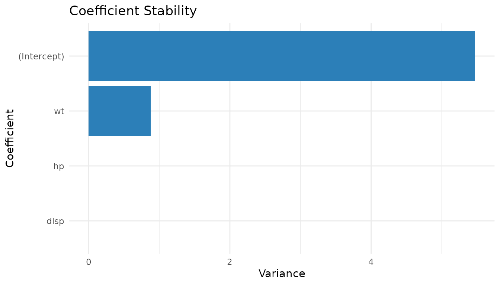
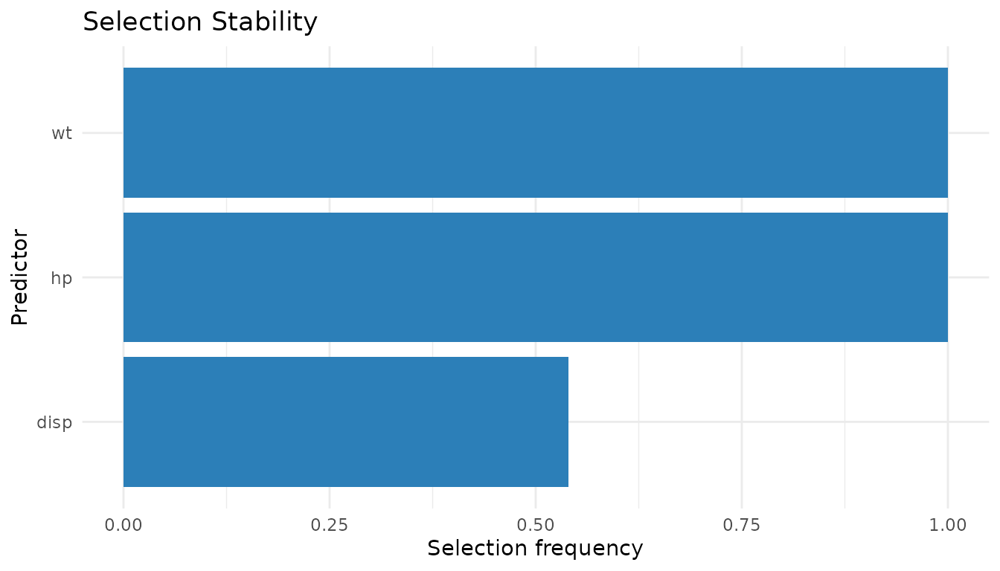

# Introduction to ReproStat

## Overview

**ReproStat** provides tools for diagnosing the reproducibility of
statistical modeling workflows. The central idea is to perturb the data
in small ways (bootstrap, subsampling, or noise) and measure how much
model outputs change across perturbations. Stable outputs imply high
reproducibility; volatile outputs flag potential concerns.

The package computes:

- **Coefficient stability** – variance of estimates across
  perturbations.
- **P-value stability** – frequency of significant findings.
- **Selection stability** – frequency of variable selection.
- **Prediction stability** – variance of predictions.
- **Reproducibility Index (RI)** – a composite 0–100 score.

## Basic workflow

### Step 1: Run diagnostics

``` r
mt_diag <- run_diagnostics(
  mpg ~ wt + hp + disp,
  data   = mtcars,
  B      = 200,
  method = "bootstrap"
)
mt_diag
#> ReproStat Diagnostics
#> ---------------------
#> Formula   : mpg ~ wt + hp + disp 
#> Backend   : lm 
#> Method    : bootstrap 
#> Iterations: 200 
#> Terms     : (Intercept), wt, hp, disp
```

### Step 2: Inspect individual metrics

``` r
coef_stability(mt_diag)
#>  (Intercept)           wt           hp         disp 
#> 6.709592e+00 1.040656e+00 1.229663e-04 7.452477e-05
pvalue_stability(mt_diag)
#>    wt    hp  disp 
#> 0.905 0.840 0.015
selection_stability(mt_diag)
#>    wt    hp  disp 
#> 1.000 1.000 0.515
prediction_stability(mt_diag)$mean_variance
#> [1] 0.9650964
```

### Step 3: Compute the reproducibility index

``` r
reproducibility_index(mt_diag)
#> $index
#> [1] 88.77472
#> 
#> $components
#>       coef     pvalue  selection prediction 
#>  0.9188745  0.8200000  0.8383333  0.9737808
```

### Step 4: Visualise

``` r
oldpar <- par(mfrow = c(1, 2))
plot_stability(mt_diag, "coefficient")
plot_stability(mt_diag, "selection")
```


``` r
par(oldpar)
```

## Perturbation methods

Three perturbation strategies are supported:

``` r
# Bootstrap resampling (default)
run_diagnostics(mpg ~ wt + hp, mtcars, method = "bootstrap")

# Subsampling (80 % of rows without replacement)
run_diagnostics(mpg ~ wt + hp, mtcars, method = "subsample", frac = 0.8)

# Gaussian noise injection (5 % of each column's SD)
run_diagnostics(mpg ~ wt + hp, mtcars, method = "noise", noise_sd = 0.05)
```

## Model comparison with CV ranking stability

Use
[`cv_ranking_stability()`](https://ntiGideon.github.io/ReproStat/reference/cv_ranking_stability.md)
to compare multiple candidate models across repeated cross-validation
runs.

``` r
models <- list(
  baseline = mpg ~ wt + hp + disp,
  compact  = mpg ~ wt + hp,
  expanded = mpg ~ wt + hp + disp + qsec
)

cv_result <- cv_ranking_stability(models, mtcars, v = 5, R = 40)
cv_result$summary
#>      model mean_rmse   sd_rmse mean_rank top1_frequency
#> 1  compact  2.684893 0.1629443     1.050           0.95
#> 2 expanded  2.811187 0.1605096     2.425           0.05
#> 3 baseline  2.798253 0.1474168     2.525           0.00
```

``` r
plot_cv_stability(cv_result, metric = "top1_frequency")
```


## Working with other datasets

The package is dataset-agnostic. Any data frame with a numeric response
and numeric predictors works:

``` r
iris_diag <- run_diagnostics(
  Sepal.Length ~ Sepal.Width + Petal.Length + Petal.Width,
  data   = iris,
  B      = 150,
  method = "noise",
  noise_sd = 0.03
)
reproducibility_index(iris_diag)
#> $index
#> [1] 99.99019
#> 
#> $components
#>       coef     pvalue  selection prediction 
#>  0.9996922  1.0000000  1.0000000  0.9999156
```

For datasets with missing values, subset to complete cases first:

``` r
aq <- na.omit(airquality[, c("Ozone", "Solar.R", "Wind", "Temp")])
aq_diag <- run_diagnostics(
  Ozone ~ Solar.R + Wind + Temp,
  data   = aq,
  B      = 150,
  method = "bootstrap"
)
reproducibility_index(aq_diag)
#> $index
#> [1] 89.77414
#> 
#> $components
#>       coef     pvalue  selection prediction 
#>  0.7181772  0.8888889  1.0000000  0.9838995
```

## Uncertainty in the RI: bootstrap confidence interval

[`ri_confidence_interval()`](https://ntiGideon.github.io/ReproStat/reference/ri_confidence_interval.md)
resamples the stored perturbation draws to estimate uncertainty in the
RI without refitting any models.

``` r
set.seed(20260307)
d <- run_diagnostics(mpg ~ wt + hp + disp, mtcars, B = 150)
ri_confidence_interval(d, level = 0.95, R = 500)
#>     2.5%    97.5% 
#> 86.89235 90.23516
```

## Modeling backends

ReproStat supports four backends. All use the same API; only the
`backend` argument changes.

``` r
# Generalized linear model (logistic)
run_diagnostics(am ~ wt + hp, mtcars, B = 100,
                family = stats::binomial())

# Robust regression (requires MASS)
if (requireNamespace("MASS", quietly = TRUE))
  run_diagnostics(mpg ~ wt + hp, mtcars, B = 100, backend = "rlm")

# LASSO (requires glmnet)
if (requireNamespace("glmnet", quietly = TRUE))
  run_diagnostics(mpg ~ wt + hp + disp + qsec, mtcars,
                  B = 100, backend = "glmnet", en_alpha = 1)
```

## ggplot2 helpers

If **ggplot2** is installed,
[`plot_stability_gg()`](https://ntiGideon.github.io/ReproStat/reference/plot_stability_gg.md)
and
[`plot_cv_stability_gg()`](https://ntiGideon.github.io/ReproStat/reference/plot_cv_stability_gg.md)
return `ggplot` objects that can be further customised.

``` r
if (requireNamespace("ggplot2", quietly = TRUE)) {
  set.seed(1)
  d_gg <- run_diagnostics(mpg ~ wt + hp + disp, mtcars, B = 50)
  print(plot_stability_gg(d_gg, "coefficient"))
  print(plot_stability_gg(d_gg, "selection"))
}
```


